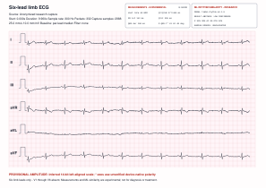

# kardia-rs

`kardia-rs` is a Rust reverse-engineering workbench for capturing, inspecting,
and decoding the Bluetooth Low Energy ECG stream from an AliveCor
KardiaMobile 6L.

The verified path connects to a bonded Kardia 6L, records every raw
notification, displays a live six-limb-lead view, inspects the observed packet
transport, exports confirmed M2 recordings to analysis-friendly CSV, and
renders printable six-lead ECG reports as vector PDF or SVG.

> [!WARNING]
> This is independent research software, not a medical device. It is not
> affiliated with or endorsed by AliveCor, and its output must not be used for
> diagnosis or treatment. Report amplitude uses a specification-derived,
> provisional scale; signal polarity and physical-unit calibration have not
> been independently validated. Automated intervals and axes are experimental
> and have not been validated against an annotated clinical ECG database. The
> optional ML rhythm-similarity model is trained on public non-Kardia data and
> has not been clinically or device-domain validated.

## Contents

- [Status](#status)
- [Requirements](#requirements)
- [Installation](#installation)
- [Quickstart](#quickstart)
- [Six-lead ECG reports](#six-lead-ecg-reports)
- [Optional ML rhythm similarity](#optional-ml-rhythm-similarity)
- [Pairing and troubleshooting](#pairing-and-troubleshooting)
- [Capture format](#capture-format)
- [M2 and M4 findings](#m2-and-m4-findings)
- [Workspace](#workspace)
- [Development](#development)
- [Contributing](#contributing)
- [Privacy](#privacy)
- [License](#license)

## Status

Tested with a `Kardia6L F241` running firmware 3.0.1 on macOS 15.7.4:

| Capability | Status |
| --- | --- |
| BLE scan, connection, GATT discovery, and characteristic reads | Confirmed |
| Encrypted/bonded vendor characteristic access | Confirmed |
| Unlock/mode command generation | Confirmed against APK and device |
| M2 dual-channel stream | 36-byte packets, 9 interleaved `i16` pairs, 300 Hz/channel |
| Channel identity | Channel 1 = lead I; channel 2 = lead II |
| Live I/II/III/aVR/aVL/aVF display | Working in uncalibrated raw counts |
| Raw capture inspection and M2 CSV export | Working |
| A4 six-lead ECG report | Vector PDF and SVG at standard 25 mm/s and 10 mm/mV |
| Automated measurements | Experimental HR, PR, QRS, QT/QTcB/QTcF, and device-native P/QRS/T axes |
| Optional ML report panel | Three-way rhythm similarity with conservative confidence/margin abstention |
| M4 dual-lead 600 Hz request | Command sent, but observed transport remains M2-compatible at 300 Hz |
| Signal polarity | Device-native direction remains unverified; report supports manual inversion |
| Volts-per-count | Provisional inference: `10 mV / 65536` per stored count; simulator validation pending |
| Linux and Windows BLE capture | Architecturally supported, not yet device-tested |

The detailed evidence log is in
[docs/re/kardia-6l.md](docs/re/kardia-6l.md). APK-derived constants and native
decoder boundaries are documented in
[docs/re/apk-inspection.md](docs/re/apk-inspection.md).

## Features

- Discovers Kardia-like BLE advertisements and inspects GATT services.
- Reproduces the vendor unlock command:
  `<mode> K<sha256("Triangle" + device_name)[..16]>`.
- Journals connection, bonding, subscription, unlock, and collection stages.
- Preserves raw command indications and ECG notifications before decoding.
- Displays a throttled six-lead view while lossless M2 capture continues.
- Distinguishes requested/nominal mode metadata from observed packet behavior.
- Inspects packet sizes, cadence, command indications, and M2 compatibility.
- Exports M2 samples with both raw channels and all six derived limb leads.
- Renders simultaneous I/II/III/aVR/aVL/aVF strips on a physically dimensioned
  A4 ECG grid as PDF or SVG.
- Builds an aligned median complex and prints confidence-gated experimental
  rate, interval, QT-correction, and frontal-axis measurements.
- Optionally runs a local, versioned ONNX waveform model and prints
  sinus-rhythm-like, AF-like, or other/noisy similarity only when conservative
  quality, confidence, and class-separation gates pass.
- Keeps captures out of Git by default because they may contain health data and
  device identifiers.

## Requirements

- Rust 1.82 or newer
- A KardiaMobile 6L
- Bluetooth Low Energy support
- An encrypted/bonded host-device relationship

Only macOS/CoreBluetooth has completed the full live-capture path so far.

## Installation

```sh
git clone https://github.com/ShaneBreazeale/kardia-rs.git
cd kardia-rs
cargo build --release
```

During development, replace `target/release/kardia` with
`cargo run -p kardia-cli --` in the examples below.

## Quickstart

Close the AliveCor mobile app before connecting so it does not claim the
device. Wake the Kardia, then scan:

```sh
cargo run -p kardia-cli -- scan --seconds 10
```

Capture 30 seconds in confirmed M2 mode and show live labeled output:

```sh
cargo run -p kardia-cli -- capture-raw \
  --mode m2 \
  --live \
  --rescan 20 \
  --seconds 30 \
  --out captures/kardia-m2.csv
```

The capture command persists every raw packet first, updates the live view at a
lower terminal rate, and prints an observed-transport inspection when it
finishes.

Inspect any saved capture again:

```sh
cargo run -p kardia-cli -- inspect-raw captures/kardia-m2.csv
```

Export a confirmed M2 capture:

```sh
cargo run -p kardia-cli -- export-six-lead-m2 \
  captures/kardia-m2.csv \
  --out captures/kardia-six-lead.csv
```

The exported columns include the raw channel pair, leads I and II, derived
III/aVR/aVL/aVF, an exact 300 Hz sample clock, and the original packet receive
timestamp. Values remain device-native counts, not millivolts.

Render the first 10 seconds as a printable report:

```sh
cargo run -p kardia-cli -- render-ecg \
  captures/kardia-m2.csv \
  --out output/pdf/kardia-six-lead.pdf
```

## Six-lead ECG Reports

`render-ecg` accepts only confirmed M2 captures and draws six simultaneous limb
leads: measured I and II plus derived III, aVR, aVL, and aVF. It does not
invent V1-V6 and labels their absence on the page.

### Sample Report



This anonymized 9.96-second sample was rendered directly from a device capture.
[Open the full-size vector report](docs/assets/kardia-six-lead-sample.svg).
The waveform and automated measurements are research output, not a medical
interpretation.

The defaults produce a landscape A4 page with:

- 25 mm/s paper speed and 10 mm/mV gain;
- a 1 mm minor and 5 mm major ECG grid;
- a 1 mV by 200 ms calibration pulse for every strip;
- an exact 300 Hz horizontal sample clock;
- per-lead median subtraction for vertical placement; and
- no smoothing, notch, high-pass, or low-pass filter applied to the displayed
  waveform.

The report also includes an **experimental automated measurements** panel:

- ventricular rate from the first-to-last detected QRS span;
- PR interval, global QRS duration, and global QT interval from an aligned
  representative median complex;
- Bazett (`QTcB`) and Fridericia (`QTcF`) rate correction using average RR; and
- frontal P/QRS/T axes calculated from the two independent I/II channels.

Beat detection uses a separate analysis copy with baseline suppression,
smoothing, multi-channel slope energy, and a refractory period. Qualifying
beats are aligned and combined sample-by-sample with a median. Wave boundaries
are then estimated from simultaneous channel slopes and return-to-baseline
tests. These analysis operations never alter the waveform drawn on the report.

Values that fail technical confidence checks are printed as `--`. “Technical
quality” describes detector confidence only, not whether an ECG is medically
normal. The P/QRS/T axes carry an asterisk because they retain the currently
unverified device-native polarity. The measurements must not be used for
diagnosis and still require validation against annotated reference databases.

The default report interval is 10 seconds. Select a later section of a longer
capture with `--start-seconds`:

```sh
cargo run -p kardia-cli -- render-ecg \
  captures/kardia-m2.csv \
  --start-seconds 10 \
  --seconds 10 \
  --out output/pdf/kardia-six-lead-page-2.pdf
```

Use an `.svg` output extension for editable vector output. `--speed-mm-s`,
`--gain-mm-mv`, and `--mv-per-count` are available for controlled experiments;
`--invert` reverses device-native polarity.

The default voltage conversion is the explicit hypothesis
`10 mV / 65536 = 0.000152587890625 mV` per stored signed count. AliveCor
specifies a 10 mV peak-to-peak input range and 14-bit resolution, while every
observed value has its low two bits clear. This is consistent with a 14-bit
sample left-aligned in a signed 16-bit field, but it is not yet an electrical
calibration. Every report carries a visible provisional-amplitude warning
until an isolated ECG simulator or equivalent traceable reference confirms the
scale and polarity.

## Optional ML Rhythm Similarity

`render-ecg` can optionally load a reviewed model manifest. Without `--model`,
no ML runtime or model is used:

```sh
cargo run -p kardia-cli -- render-ecg \
  captures/kardia-m2.csv \
  --model models/limb6-rhythm-v0.1.0.json \
  --out output/pdf/kardia-six-lead-with-ml.pdf
```

The model receives a separate analysis copy of the same six displayed limb
leads. The 300 Hz signal is reduced to the model's declared 100 Hz input,
median-centered, normalized using the two independent I/II channels, and
clipped to the manifest's training range. This processing does not alter the
waveform drawn on the report.

Before inference, the CLI validates the model SHA-256, manifest schema, label
order, lead order, tensor shape, research-only declaration, and threshold
ranges. It abstains when deterministic technical quality is not `GOOD`, the
top probability is below its class-specific threshold, or the top-two class
margin is too small. The report always labels the result as research-only and
the Kardia domain as unvalidated.

The three outputs are similarity categories, not diagnoses:

- `sinus-rhythm-like`: resembles public training records explicitly labeled
  sinus rhythm;
- `af-like`: resembles records explicitly labeled atrial fibrillation; and
- `other/noisy`: alternative rhythms, listed signal contamination, or other
  unsupported patterns.

“Sinus-rhythm-like” does not mean “normal ECG,” and an abstention is an
intentional output rather than an error. V1-V6-dependent findings must not be
inferred from this device. The complete reproducible data-labeling, training,
calibration, evaluation, and ONNX-export workflow is in
[ml/README.md](ml/README.md). Architecture, thresholds, held-out results, and
device-domain limitations are recorded in the
[model card](models/limb6-rhythm-v0.1.0.md).

## Pairing and Troubleshooting

The `ac06000x` vendor characteristics require an encrypted BLE link. Without a
valid bond, writes can return ATT error 5 (*Insufficient Authentication*) and
vendor notification subscriptions can stall.

If capture does not reach the unlock write:

1. Close the AliveCor app.
2. Forget or remove the Kardia relationship from the phone.
3. Remove the Kardia battery for about 15 seconds, then reinstall it.
4. Wake the device and rerun `capture-raw`.
5. Accept the macOS pairing dialog when it appears.

Run the lower-level probes when isolating a failure:

Inspect every service and characteristic:

```sh
cargo run -p kardia-cli -- gatt-dump --rescan 20
```

Read every readable characteristic:

```sh
cargo run -p kardia-cli -- read-probe --rescan 90 --verbose
```

Compare a standard battery subscription with the vendor ECG subscription:

```sh
cargo run -p kardia-cli -- notify-probe --rescan 90 --verbose
```

The device advertises for a short window. Wake it immediately before scanning,
and prefer `capture-raw` first when collecting evidence.

## Capture Format

Raw captures are append-only CSV-like text:

```text
 # kardia_raw_capture_v2 ... requested_mode=M2 nominal_sample_rate_hz=300 ...
 # stage unix_micros=... name="connect_and_discover" status="ok" detail=""
 # unix_micros,characteristic_uuid,payload_hex
1784854547341388,ac060002-328c-a28f-9846-5a8aa212661b,01
```

Header mode/rate fields describe what was requested from the device. They are
not treated as observed signal facts. `inspect-raw` derives packet cadence,
payload sizes, command indications, and compatible sample rates from the
records themselves. The parser remains backward-compatible with v1 captures.

## M2 and M4 Findings

Confirmed M2 notifications contain nine little-endian signed 16-bit pairs:

```text
[channel_1_sample_0, channel_2_sample_0, ... channel_1_sample_8, channel_2_sample_8]
```

At 33 1/3 packets/s, that is 300 samples/s/channel. Controlled contact-removal
tests identify channel 1 as lead I and channel 2 as lead II. Standard limb-lead
relationships derive the remaining four leads.

M4 is present in the APK as “dual lead, 600 Hz.” On the tested device it
returned indication `0x03`, but still produced 36-byte packets at 33.336
packets/s that decode cleanly as the same 300 Hz M2-compatible transport. The
software therefore records M4 raw data but does not label or export it as 600
Hz.

## Workspace

| Path | Responsibility |
| --- | --- |
| `crates/kardia-core` | Protocol-neutral samples, timestamps, recording metadata, and limb-lead derivation |
| `crates/kardia-ble` | Device identification, mode commands, live BLE capture, raw capture parsing, and packet decoding |
| `crates/kardia-cli` | Scan/probe/capture/inspect/export workflows and live terminal view |
| `docs/re` | Evidence log, APK findings, hypotheses, and unresolved questions |
| `scripts/bleak_probe.py` | Independent Python/CoreBluetooth probe for comparing `bleak` with `btleplug` |

The BLE layer owns device evidence and lossless capture. The core crate remains
independent of AliveCor-specific framing so future UI, replay, and model code
can consume stable ECG types.

## Cross-checking with Bleak

The Python probe runs the same scan/read/subscribe/unlock sequence through
Apple CoreBluetooth via
[`bleak`](https://github.com/hbldh/bleak):

```sh
uv venv .venv
uv pip install --python .venv/bin/python bleak
.venv/bin/python scripts/bleak_probe.py --stream --scan-secs 120
```

If a step works in `bleak` but not `btleplug`, investigate the Rust BLE layer.
If both fail at the same operation, investigate bonding or device behavior.

## Development

```sh
cargo fmt --all -- --check
cargo check --workspace
cargo test --workspace
cargo clippy --workspace --all-targets -- -D warnings
```

The workspace currently has three crates and requires no external services for
unit tests. Live BLE verification requires the physical device.

## Contributing

Reverse-engineering changes should:

- preserve raw bytes and receive timestamps before interpretation;
- distinguish requested configuration from observed behavior;
- cite the device, firmware, host, command, and capture statistics;
- add parser/decoder tests with synthetic or deliberately anonymized fixtures;
- avoid committing personal ECG captures; and
- update [docs/re/kardia-6l.md](docs/re/kardia-6l.md) when evidence changes an
  assumption.

Please run the complete development command set before opening a pull request.

## Privacy

ECG captures are health-related data and may also contain device identifiers.
The repository ignores `captures/` by default. Do not publish a capture unless
it has been intentionally reviewed, minimized, and anonymized.

When sharing a generated report, replace its local input path with a neutral
label:

```sh
cargo run -p kardia-cli -- render-ecg \
  captures/kardia-m2.csv \
  --source-label "Anonymized research capture" \
  --out report.svg
```

## License

Licensed under either the Apache License, Version 2.0 or the MIT License, at
your option, as declared by the workspace manifests.
